# Architecture Notes - Roo Code Extension

# TRP1 Challenge: Intent-Code Traceability System

**Date**: 2026-02-21  
**Purpose**: Document architecture and the implemented Intent-Governed Hook Middleware (intent-code traceability, HITL, trace, Shared Brain).

---

## Table of Contents

1. [Overall Architecture](#overall-architecture)
2. [System Prompt Construction](#1-system-prompt-construction)
3. [LLM Response Parsing](#2-llm-response-parsing)
4. [Tool Call Dispatch](#3-tool-call-dispatch)
5. [write_to_file Implementation](#4-write_to_file-implementation)
6. [execute_command Implementation](#5-execute_command-implementation)
7. [Task State Storage](#6-task-state-storage)
8. [Message Flow](#7-message-flow)
9. [Hook Integration Points](#8-hook-integration-points)
10. [TRP1 Implemented: Intent-Governed Hook Middleware (Detailed)](#10-trp1-implemented-intent-governed-hook-middleware-detailed)
11. [Implementation Roadmap](#9-implementation-roadmap)
12. [Critical Code References](#11-critical-code-references)
13. [File Structure for Hook System](#12-file-structure-for-hook-system)

---

## Overall Architecture

### System Overview

Roo Code is a VS Code extension that provides an AI-powered coding assistant. The system follows a layered architecture where user interactions flow through multiple components before reaching the LLM and back.

### High-Level Architecture Diagram

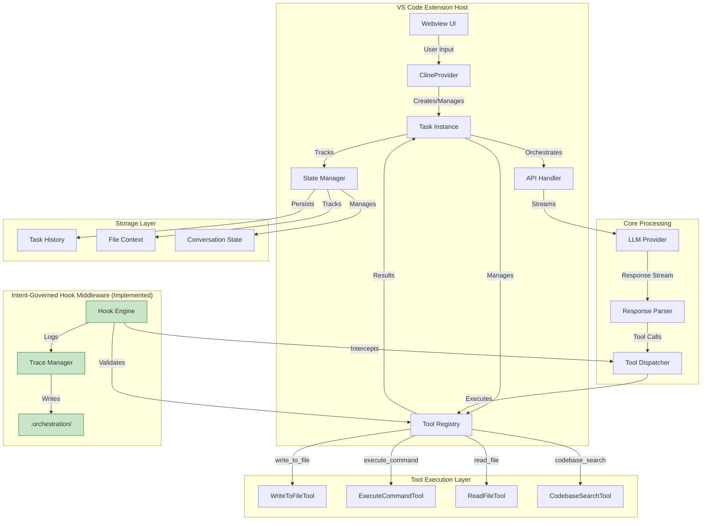
```mermaid
graph TB
    subgraph "VS Code Extension Host"
        A[Webview UI] -->|User Input| B[ClineProvider]
        B -->|Creates/Manages| C[Task Instance]
        C -->|Orchestrates| D[API Handler]
        C -->|Manages| E[Tool Registry]
        C -->|Tracks| F[State Manager]
    end

    subgraph "Core Processing"
        D -->|Streams| G[LLM Provider]
        G -->|Response Stream| H[Response Parser]
        H -->|Tool Calls| I[Tool Dispatcher]
        I -->|Executes| E
        E -->|Results| C
    end

    subgraph "Tool Execution Layer"
        E -->|write_to_file| J[WriteToFileTool]
        E -->|execute_command| K[ExecuteCommandTool]
        E -->|read_file| L[ReadFileTool]
        E -->|codebase_search| M[CodebaseSearchTool]
    end

    subgraph "Storage Layer"
        F -->|Persists| N[Task History]
        F -->|Tracks| O[File Context]
        F -->|Manages| P[Conversation State]
    end

    subgraph "Intent-Governed Hook Middleware (Implemented)"
        Q[Hook Engine] -->|Intercepts| I
        Q -->|Validates| E
        Q -->|Logs| R[Trace Manager]
        R -->|Writes| S[.orchestration/]
    end

    style Q fill:#c8e6c9,stroke:#2e7d32
    style R fill:#c8e6c9,stroke:#2e7d32
    style S fill:#c8e6c9,stroke:#2e7d32
```

### Component Interaction Flow

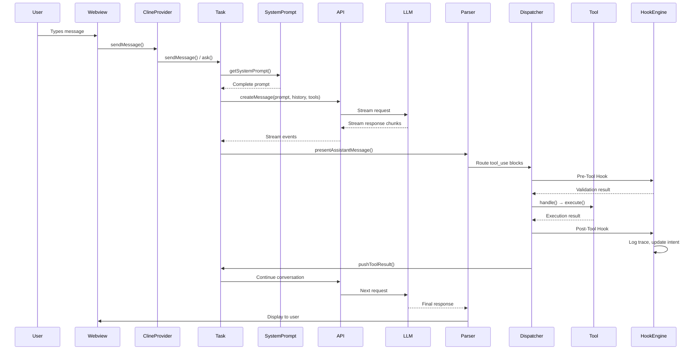
```mermaid
sequenceDiagram
    participant User
    participant Webview
    participant ClineProvider
    participant Task
    participant SystemPrompt
    participant API
    participant LLM
    participant Parser
    participant Dispatcher
    participant Tool
    participant HookEngine

    User->>Webview: Types message
    Webview->>ClineProvider: sendMessage()
    ClineProvider->>Task: sendMessage() / ask()
    Task->>SystemPrompt: getSystemPrompt()
    SystemPrompt-->>Task: Complete prompt
    Task->>API: createMessage(prompt, history, tools)
    API->>LLM: Stream request
    LLM-->>API: Stream response chunks
    API-->>Task: Stream events
    Task->>Parser: presentAssistantMessage()
    Parser->>Dispatcher: Route tool_use blocks
    Dispatcher->>HookEngine: Pre-Tool Hook
    HookEngine-->>Dispatcher: Validation result
    Dispatcher->>Tool: handle() → execute()
    Tool-->>Dispatcher: Execution result
    Dispatcher->>HookEngine: Post-Tool Hook
    HookEngine->>HookEngine: Log trace, update intent
    Dispatcher->>Task: pushToolResult()
    Task->>API: Continue conversation
    API->>LLM: Next request
    LLM-->>Parser: Final response
    Parser->>Webview: Display to user
```

---

## 1. System Prompt Construction

### Description

The system prompt is the foundational instruction set that guides the LLM's behavior. It's dynamically assembled from multiple sources including role definitions, tool guidelines, custom rules, and user instructions. The prompt construction happens before every API call to ensure the LLM has the most up-to-date context and constraints.

### Architecture Diagram

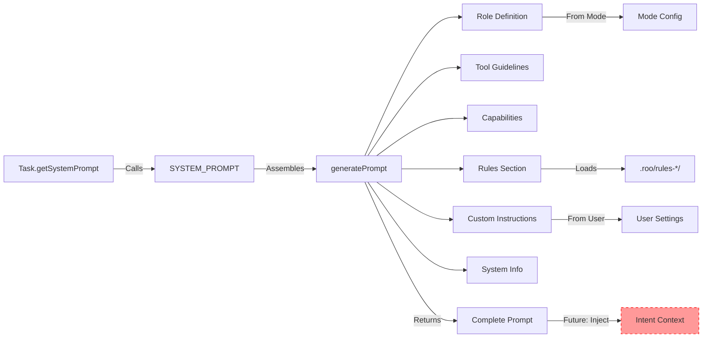
```mermaid
graph LR
    A[Task.getSystemPrompt] -->|Calls| B[SYSTEM_PROMPT]
    B -->|Assembles| C[generatePrompt]

    C --> D[Role Definition]
    C --> E[Tool Guidelines]
    C --> F[Capabilities]
    C --> G[Rules Section]
    C --> H[Custom Instructions]
    C --> I[System Info]

    D -->|From Mode| J[Mode Config]
    G -->|Loads| K[.roo/rules-*/]
    H -->|From User| L[User Settings]

    C -->|Returns| M[Complete Prompt]
    M -->|Future: Inject| N[Intent Context]

    style N fill:#ff9999,stroke:#ff0000,stroke-dasharray: 5 5
```

### Detailed Flow

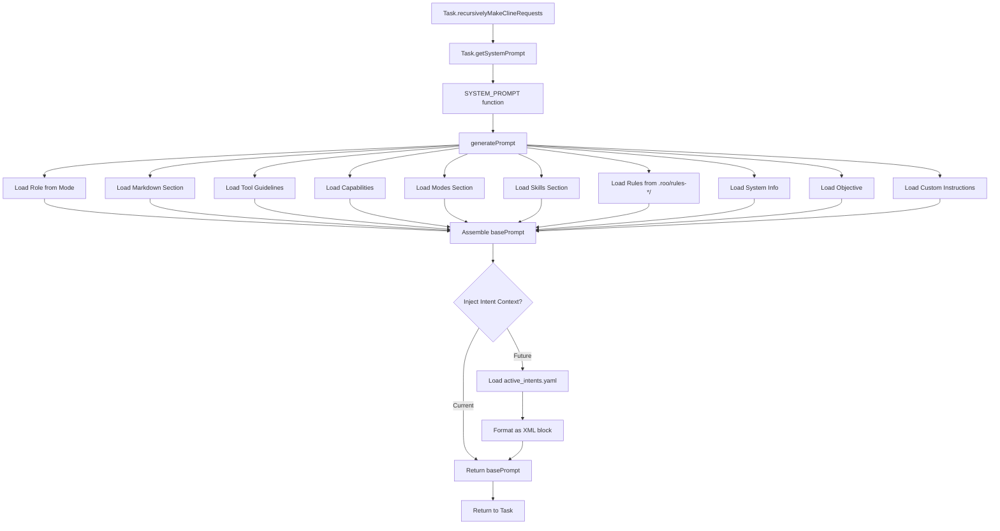
```mermaid
flowchart TD
    Start[Task.recursivelyMakeClineRequests] --> GetPrompt[Task.getSystemPrompt]
    GetPrompt --> SystemPrompt[SYSTEM_PROMPT function]

    SystemPrompt --> Generate[generatePrompt]

    Generate --> LoadRole[Load Role from Mode]
    Generate --> LoadMarkdown[Load Markdown Section]
    Generate --> LoadTools[Load Tool Guidelines]
    Generate --> LoadCaps[Load Capabilities]
    Generate --> LoadModes[Load Modes Section]
    Generate --> LoadSkills[Load Skills Section]
    Generate --> LoadRules[Load Rules from .roo/rules-*/]
    Generate --> LoadSystem[Load System Info]
    Generate --> LoadObjective[Load Objective]
    Generate --> LoadCustom[Load Custom Instructions]

    LoadRole --> Assemble[Assemble basePrompt]
    LoadMarkdown --> Assemble
    LoadTools --> Assemble
    LoadCaps --> Assemble
    LoadModes --> Assemble
    LoadSkills --> Assemble
    LoadRules --> Assemble
    LoadSystem --> Assemble
    LoadObjective --> Assemble
    LoadCustom --> Assemble

    Assemble --> HookPoint{Inject Intent Context?}
    HookPoint -->|Future| InjectIntent[Load active_intents.yaml]
    HookPoint -->|Current| ReturnPrompt[Return basePrompt]
    InjectIntent --> FormatIntent[Format as XML block]
    FormatIntent --> ReturnPrompt

    ReturnPrompt --> End[Return to Task]
```

### Code Locations

**Primary Location**: `src/core/prompts/system.ts`

- **Main Function**: `SYSTEM_PROMPT()` (lines 112-158)

    - Entry point that orchestrates prompt generation
    - Called from: `Task.getSystemPrompt()` (line 3792 in Task.ts)

- **Internal Function**: `generatePrompt()` (lines 41-110)
    - Assembles all prompt sections into a cohesive instruction set
    - Sections include: role, markdown, tools, capabilities, modes, skills, rules, system info, objective, custom instructions

**Key Sections** (from `src/core/prompts/sections/`):

- `getRulesSection()` - Dynamically loads rules from `.roo/rules-*/` directories
- `getToolUseGuidelinesSection()` - Provides tool usage instructions
- `getCapabilitiesSection()` - Describes system capabilities
- `addCustomInstructions()` - Injects user-defined custom instructions

### Hook Integration Point

**Location**: `src/core/prompts/system.ts` → `generatePrompt()` function

**Pre-Hook Action**: Before returning `basePrompt` (line 109), inject `<intent_context>` XML block containing:

- Active intent ID and description
- Intent scope (file patterns, directories)
- Intent constraints and requirements
- Related intent history

**Modification Strategy**:

1. Add intent context loading in `SYSTEM_PROMPT()` or `generatePrompt()`
2. Query `IntentManager` for active intent
3. Format as XML block and append to prompt
4. Ensure intent context is refreshed on each API call

---

## 2. LLM Response Parsing

### Description

The response parsing layer handles streaming LLM responses in real-time. It processes text blocks, tool calls, and reasoning content as they arrive, maintaining conversation state and dispatching tool executions. The parser must handle partial messages, streaming tool calls, and various response formats from different LLM providers.

### Architecture Diagram

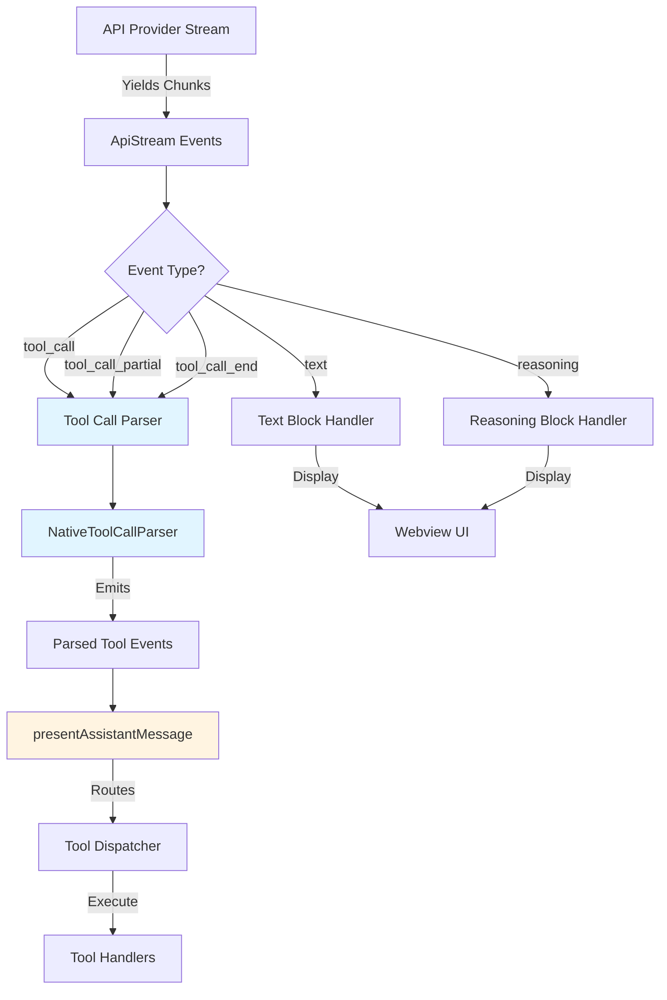
```mermaid
graph TB
    A[API Provider Stream] -->|Yields Chunks| B[ApiStream Events]

    B --> C{Event Type?}

    C -->|text| D[Text Block Handler]
    C -->|reasoning| E[Reasoning Block Handler]
    C -->|tool_call| F[Tool Call Parser]
    C -->|tool_call_partial| F
    C -->|tool_call_end| F

    F --> G[NativeToolCallParser]
    G -->|Emits| H[Parsed Tool Events]

    H --> I[presentAssistantMessage]
    I -->|Routes| J[Tool Dispatcher]

    D -->|Display| K[Webview UI]
    E -->|Display| K
    J -->|Execute| L[Tool Handlers]

    style F fill:#e1f5ff
    style G fill:#e1f5ff
    style I fill:#fff4e1
```

### Parsing Flow

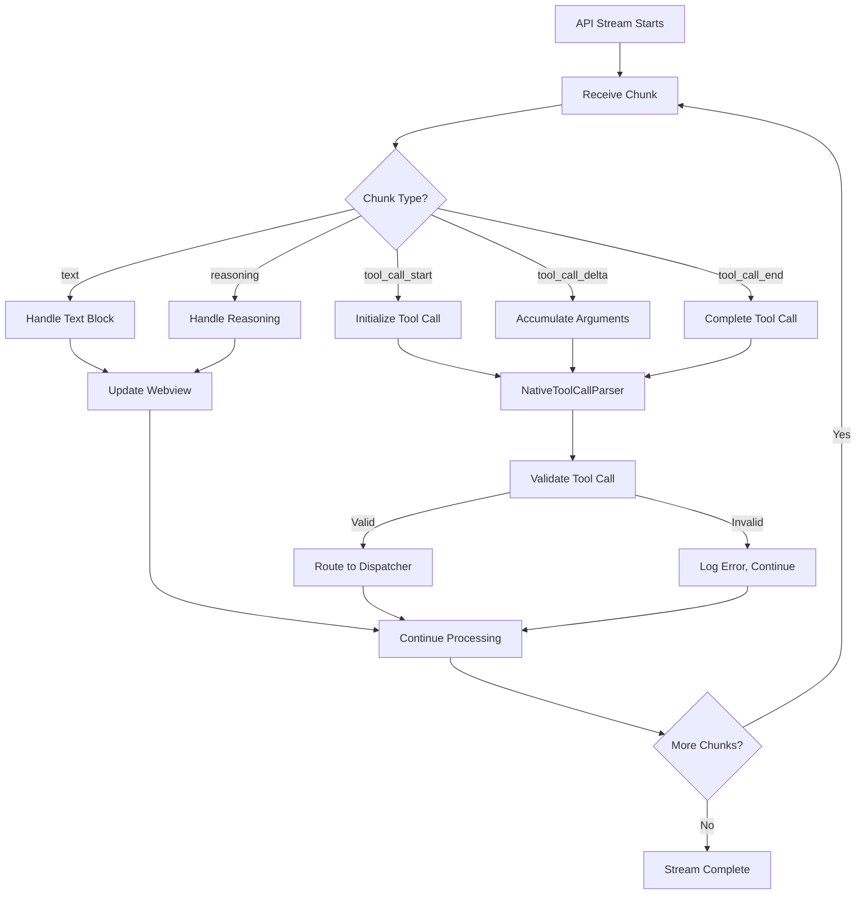
```mermaid
flowchart TD
    Start[API Stream Starts] --> Receive[Receive Chunk]

    Receive --> CheckType{Chunk Type?}

    CheckType -->|text| TextHandler[Handle Text Block]
    CheckType -->|reasoning| ReasoningHandler[Handle Reasoning]
    CheckType -->|tool_call_start| ToolStart[Initialize Tool Call]
    CheckType -->|tool_call_delta| ToolDelta[Accumulate Arguments]
    CheckType -->|tool_call_end| ToolEnd[Complete Tool Call]

    TextHandler --> UpdateUI[Update Webview]
    ReasoningHandler --> UpdateUI

    ToolStart --> Parser[NativeToolCallParser]
    ToolDelta --> Parser
    ToolEnd --> Parser

    Parser --> Validate[Validate Tool Call]
    Validate -->|Valid| Dispatch[Route to Dispatcher]
    Validate -->|Invalid| Error[Log Error, Continue]

    Dispatch --> End[Continue Processing]
    UpdateUI --> End
    Error --> End

    End --> More{More Chunks?}
    More -->|Yes| Receive
    More -->|No| Complete[Stream Complete]
```

### Code Locations

**Primary Location**: `src/core/assistant-message/presentAssistantMessage.ts`

- **Main Function**: `presentAssistantMessage(cline: Task)` (line 61)
    - Central orchestrator for processing streaming assistant responses
    - Handles text blocks, tool_use blocks, and tool_result blocks
    - Manages partial message streaming and UI updates

**Response Stream Processing**:

- **Location**: `src/api/providers/*.ts` (various provider implementations)
- **Key Providers**:
    - `src/api/providers/openai-native.ts` → `handleStreamResponse()` (line 658)
    - `src/api/providers/openai-codex.ts` → `handleStreamResponse()` (line 581)
    - `src/api/providers/anthropic.ts` → Stream processing
    - `src/api/providers/gemini.ts` → Stream processing

**Stream Format**:

- Providers yield `ApiStream` chunks with types: `text`, `reasoning`, `tool_call`, `tool_call_partial`, `tool_call_end`
- Chunks are processed incrementally as they arrive

**Tool Call Parsing**:

- **File**: `src/core/assistant-message/NativeToolCallParser.ts`
- **Key Methods**:
    - `processRawChunk()` (line 99) - Processes streaming tool call chunks
    - `processFinishReason()` (line 167) - Handles tool call completion
    - Tracks partial tool calls and accumulates arguments incrementally

### Hook Integration Point

**Location**: `src/core/assistant-message/presentAssistantMessage.ts`

**Pre-Hook**: After parsing tool_use block (line 678), before tool dispatch:

- Validate tool call against active intent
- Check if tool is allowed for current intent
- Inject intent context into tool parameters

**Post-Hook**: After tool execution completes, before `pushToolResult()`:

- Log tool execution to trace
- Update intent progress
- Validate execution results against intent requirements

---

## 3. Tool Call Dispatch

### Description

The tool dispatch system routes parsed tool calls to their respective handlers. It uses a switch statement to match tool names to tool instances, then invokes the standardized `handle()` method. This is the critical interception point where all tool executions flow through, making it ideal for hook injection.

### Architecture Diagram

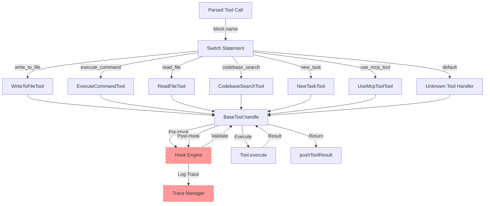
```mermaid
graph TB
    A[Parsed Tool Call] -->|block.name| B[Switch Statement]

    B -->|write_to_file| C[WriteToFileTool]
    B -->|execute_command| D[ExecuteCommandTool]
    B -->|read_file| E[ReadFileTool]
    B -->|codebase_search| F[CodebaseSearchTool]
    B -->|new_task| G[NewTaskTool]
    B -->|use_mcp_tool| H[UseMcpToolTool]
    B -->|default| I[Unknown Tool Handler]

    C --> J[BaseTool.handle]
    D --> J
    E --> J
    F --> J
    G --> J
    H --> J
    I --> J

    J -->|Pre-Hook| K[Hook Engine]
    K -->|Validate| J
    J -->|Execute| L[Tool.execute]
    L -->|Result| J
    J -->|Post-Hook| K
    K -->|Log Trace| M[Trace Manager]

    J -->|Return| N[pushToolResult]

    style K fill:#ff9999,stroke:#ff0000,stroke-dasharray: 5 5
    style M fill:#ff9999,stroke:#ff0000,stroke-dasharray: 5 5
```

### Dispatch Flow

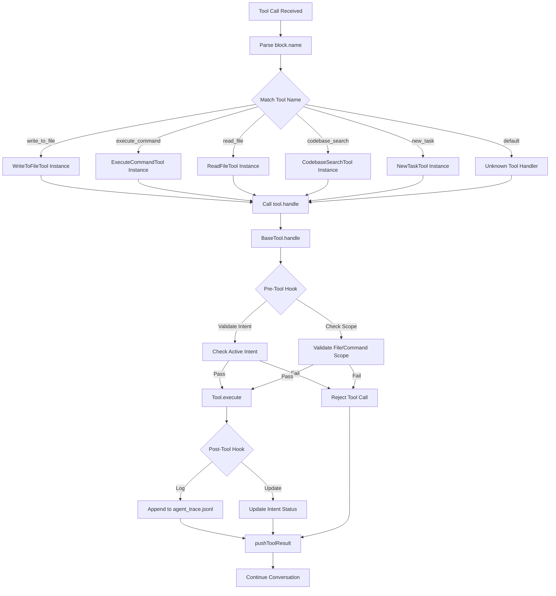
```mermaid
flowchart TD
    Start[Tool Call Received] --> Parse[Parse block.name]

    Parse --> Switch{Match Tool Name}

    Switch -->|write_to_file| WTF[WriteToFileTool Instance]
    Switch -->|execute_command| EC[ExecuteCommandTool Instance]
    Switch -->|read_file| RF[ReadFileTool Instance]
    Switch -->|codebase_search| CS[CodebaseSearchTool Instance]
    Switch -->|new_task| NT[NewTaskTool Instance]
    Switch -->|default| UN[Unknown Tool Handler]

    WTF --> Handle[Call tool.handle]
    EC --> Handle
    RF --> Handle
    CS --> Handle
    NT --> Handle
    UN --> Handle

    Handle --> BaseHandle[BaseTool.handle]

    BaseHandle --> PreHook{Pre-Tool Hook}
    PreHook -->|Validate Intent| Validate[Check Active Intent]
    PreHook -->|Check Scope| Scope[Validate File/Command Scope]

    Validate -->|Pass| Execute[Tool.execute]
    Validate -->|Fail| Reject[Reject Tool Call]
    Scope -->|Pass| Execute
    Scope -->|Fail| Reject

    Execute --> PostHook{Post-Tool Hook}
    PostHook -->|Log| Trace[Append to agent_trace.jsonl]
    PostHook -->|Update| Intent[Update Intent Status]

    Trace --> Result[pushToolResult]
    Intent --> Result
    Reject --> Result

    Result --> End[Continue Conversation]
```

### Code Locations

**Primary Location**: `src/core/assistant-message/presentAssistantMessage.ts`

**Dispatch Logic**: Switch statement (line 678-850)

- Routes tool calls to appropriate tool handlers based on `block.name`
- Each case calls `tool.handle(task, block, callbacks)`

**Key Dispatch Cases**:

```typescript
case "write_to_file":      // Line 679
case "execute_command":    // Line 764
case "read_file":          // Line 735
case "codebase_search":    // Line 750
case "new_task":           // Line 806
// ... etc
```

**Tool Handler Pattern**:

```typescript
await toolNameTool.handle(cline, block as ToolUse<"tool_name">, {
	askApproval,
	handleError,
	pushToolResult,
})
```

**Base Tool Handler**:

- **File**: `src/core/tools/BaseTool.ts`
- **Method**: `handle()` (line 113)
    - Entry point for all tool execution
    - Handles partial messages
    - Parses parameters from `nativeArgs`
    - Calls `execute()` method

### Hook Integration Point

**Primary Location**: `src/core/tools/BaseTool.ts` → `handle()` method (line 113)

**Pre-Hook**: Before `execute()` call (line 160):

- Validate active intent exists
- Check file path/command against intent scope
- Load intent context for tool execution
- Enforce intent constraints

**Post-Hook**: After `execute()` completes:

- Calculate content hash (for file operations)
- Append execution to `agent_trace.jsonl`
- Update intent status and progress
- Validate results against intent requirements

**Alternative Location**: `src/core/assistant-message/presentAssistantMessage.ts` → switch statement (line 678)

- **Pre-Hook**: Before `tool.handle()` call in each case
- **Post-Hook**: After `tool.handle()` completes
- **Advantage**: Centralized interception point for all tools
- **Disadvantage**: Less granular control per tool type

---

## 4. write_to_file Implementation

### Description

The `write_to_file` tool handles file creation and modification operations. It validates file access, checks write protection, shows diffs to users for approval, and tracks file context. This is a critical tool for intent-code traceability as every file modification must be linked to an active intent and logged to the trace.

### Architecture Diagram

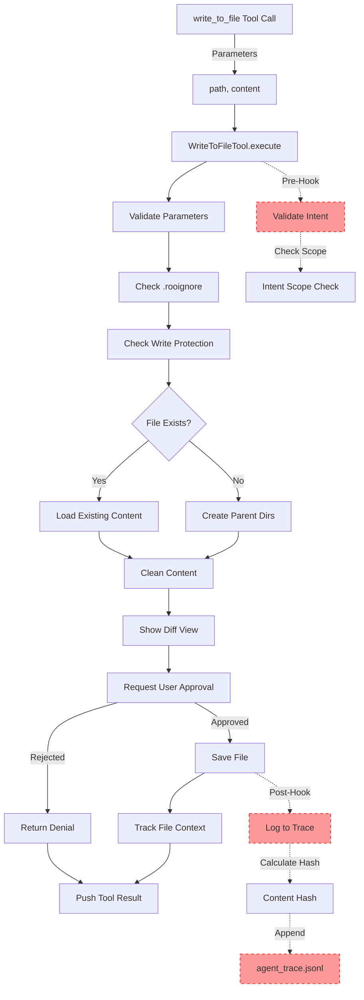
```mermaid
graph TB
    A[write_to_file Tool Call] -->|Parameters| B[path, content]

    B --> C[WriteToFileTool.execute]

    C --> D[Validate Parameters]
    D --> E[Check .rooignore]
    E --> F[Check Write Protection]
    F --> G{File Exists?}

    G -->|No| H[Create Parent Dirs]
    G -->|Yes| I[Load Existing Content]

    H --> J[Clean Content]
    I --> J

    J --> K[Show Diff View]
    K --> L[Request User Approval]

    L -->|Approved| M[Save File]
    L -->|Rejected| N[Return Denial]

    M --> O[Track File Context]
    O --> P[Push Tool Result]

    N --> P

    C -.->|Pre-Hook| Q[Validate Intent]
    Q -.->|Check Scope| R[Intent Scope Check]
    M -.->|Post-Hook| S[Log to Trace]
    S -.->|Calculate Hash| T[Content Hash]
    T -.->|Append| U[agent_trace.jsonl]

    style Q fill:#ff9999,stroke:#ff0000,stroke-dasharray: 5 5
    style S fill:#ff9999,stroke:#ff0000,stroke-dasharray: 5 5
    style U fill:#ff9999,stroke:#ff0000,stroke-dasharray: 5 5
```

### Execution Flow

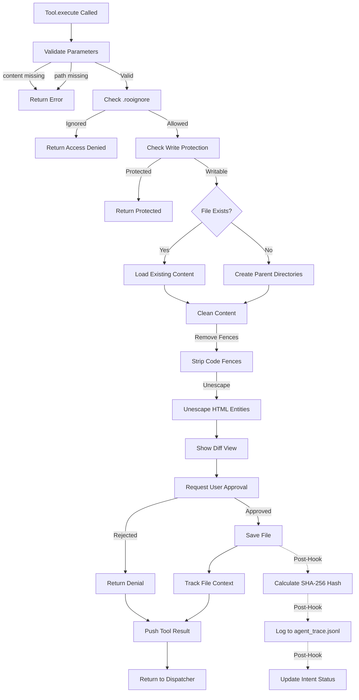
```mermaid
flowchart TD
    Start[Tool.execute Called] --> Validate[Validate Parameters]

    Validate -->|path missing| Error1[Return Error]
    Validate -->|content missing| Error1
    Validate -->|Valid| CheckIgnore[Check .rooignore]

    CheckIgnore -->|Ignored| Error2[Return Access Denied]
    CheckIgnore -->|Allowed| CheckProtect[Check Write Protection]

    CheckProtect -->|Protected| Error3[Return Protected]
    CheckProtect -->|Writable| CheckExists{File Exists?}

    CheckExists -->|No| CreateDirs[Create Parent Directories]
    CheckExists -->|Yes| LoadFile[Load Existing Content]

    CreateDirs --> CleanContent[Clean Content]
    LoadFile --> CleanContent

    CleanContent -->|Remove Fences| StripMarkdown[Strip Code Fences]
    StripMarkdown -->|Unescape| UnescapeHTML[Unescape HTML Entities]

    UnescapeHTML --> ShowDiff[Show Diff View]
    ShowDiff --> RequestApproval[Request User Approval]

    RequestApproval -->|Approved| SaveFile[Save File]
    RequestApproval -->|Rejected| Deny[Return Denial]

    SaveFile --> TrackContext[Track File Context]
    TrackContext --> PushResult[Push Tool Result]
    Deny --> PushResult

    SaveFile -.->|Post-Hook| CalcHash[Calculate SHA-256 Hash]
    CalcHash -.->|Post-Hook| LogTrace[Log to agent_trace.jsonl]
    LogTrace -.->|Post-Hook| UpdateIntent[Update Intent Status]

    PushResult --> End[Return to Dispatcher]
```

### Code Locations

**Primary Location**: `src/core/tools/WriteToFileTool.ts`

**Class**: `WriteToFileTool` extends `BaseTool<"write_to_file">`

**Main Method**: `execute()` (line 29)

- **Parameters**: `{ path: string, content: string }`
- **Flow**:
    1. Validates parameters (lines 34-48)
    2. Checks `.rooignore` access (line 50)
    3. Checks write protection (line 58)
    4. Determines if file exists (lines 60-68)
    5. Creates parent directories if needed (line 73)
    6. Cleans content (removes markdown code fences, unescapes HTML) (lines 76-86)
    7. Shows diff view (lines 111-169)
    8. Requests approval via `askApproval()` (line 130 or 162)
    9. Saves file via `diffViewProvider.saveDirectly()` or `saveChanges()` (line 136 or 169)
    10. Tracks file context (line 173)
    11. Pushes tool result (line 180)

**Partial Message Handling**: `handlePartial()` (line 196)

- Handles streaming file writes
- Shows preview as content streams in

**Integration Points**:

- **DiffViewProvider**: `src/integrations/editor/DiffViewProvider.ts`
- **File Context Tracking**: `task.fileContextTracker.trackFileContext()` (line 173)
- **Approval**: `askApproval("tool", completeMessage)` (line 130 or 162)

### Hook Integration Point

**Location**: `src/core/tools/WriteToFileTool.ts` → `execute()` method

**Pre-Hook**: After validation (line 48), before file operations:

1. Check active intent exists (via `IntentManager`)
2. Validate file path against intent scope (check if path matches intent's file patterns)
3. Load intent context for file operation
4. Enforce intent constraints (e.g., no modifications outside scope)

**Post-Hook**: After file save (line 169), before `pushToolResult()`:

1. Calculate content hash (SHA-256 of file content)
2. Append to `agent_trace.jsonl` with:
    - `intent_id`: Active intent ID
    - `content_hash`: SHA-256 hash
    - `file_path`: Relative path from workspace root
    - `mutation_class`: "create" or "modify"
    - `line_ranges`: Affected line ranges (if applicable)
    - `timestamp`: ISO 8601 timestamp
3. Update intent status (mark as "in_progress" or "completed" based on intent requirements)
4. Update `intent_map.md` with file-to-intent mapping

---

## 5. execute_command Implementation

### Description

The `execute_command` tool executes shell commands in the workspace terminal. It validates commands against `.rooignore` patterns, requests user approval for safety, and captures command output. For intent traceability, command executions must be logged and validated against intent constraints to prevent unauthorized operations.

### Architecture Diagram

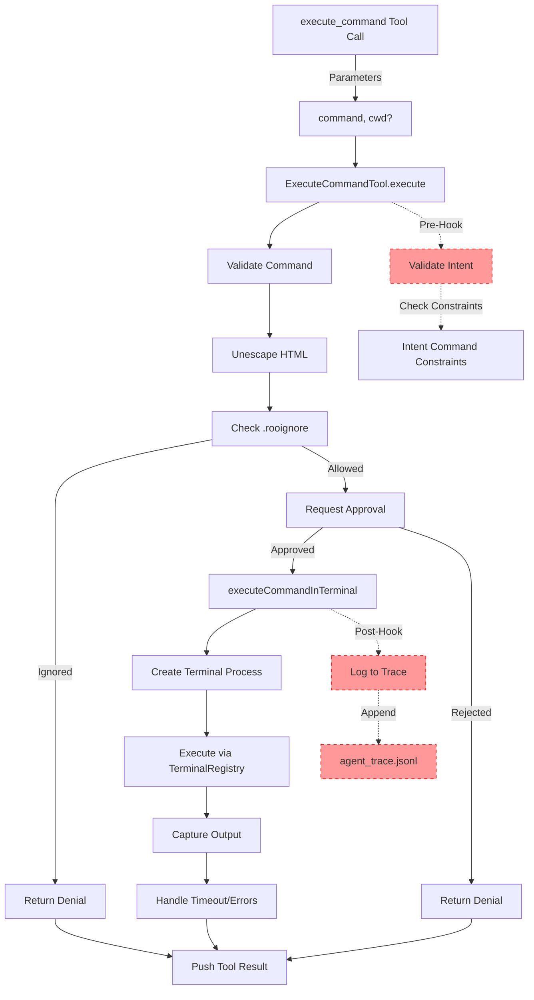
```mermaid
graph TB
    A[execute_command Tool Call] -->|Parameters| B[command, cwd?]

    B --> C[ExecuteCommandTool.execute]

    C --> D[Validate Command]
    D --> E[Unescape HTML]
    E --> F[Check .rooignore]

    F -->|Ignored| G[Return Denial]
    F -->|Allowed| H[Request Approval]

    H -->|Approved| I[executeCommandInTerminal]
    H -->|Rejected| J[Return Denial]

    I --> K[Create Terminal Process]
    K --> L[Execute via TerminalRegistry]
    L --> M[Capture Output]
    M --> N[Handle Timeout/Errors]

    N --> O[Push Tool Result]
    G --> O
    J --> O

    C -.->|Pre-Hook| P[Validate Intent]
    P -.->|Check Constraints| Q[Intent Command Constraints]
    I -.->|Post-Hook| R[Log to Trace]
    R -.->|Append| S[agent_trace.jsonl]

    style P fill:#ff9999,stroke:#ff0000,stroke-dasharray: 5 5
    style R fill:#ff9999,stroke:#ff0000,stroke-dasharray: 5 5
    style S fill:#ff9999,stroke:#ff0000,stroke-dasharray: 5 5
```

### Execution Flow

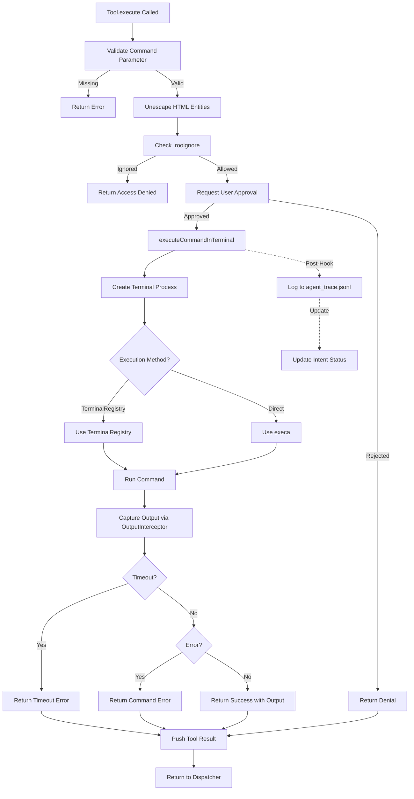
```mermaid
flowchart TD
    Start[Tool.execute Called] --> Validate[Validate Command Parameter]

    Validate -->|Missing| Error1[Return Error]
    Validate -->|Valid| Unescape[Unescape HTML Entities]

    Unescape --> CheckIgnore[Check .rooignore]

    CheckIgnore -->|Ignored| Error2[Return Access Denied]
    CheckIgnore -->|Allowed| RequestApproval[Request User Approval]

    RequestApproval -->|Rejected| Deny[Return Denial]
    RequestApproval -->|Approved| Execute[executeCommandInTerminal]

    Execute --> CreateTerminal[Create Terminal Process]
    CreateTerminal --> ChooseMethod{Execution Method?}

    ChooseMethod -->|TerminalRegistry| UseRegistry[Use TerminalRegistry]
    ChooseMethod -->|Direct| UseExeca[Use execa]

    UseRegistry --> RunCommand[Run Command]
    UseExeca --> RunCommand

    RunCommand --> CaptureOutput[Capture Output via OutputInterceptor]
    CaptureOutput --> CheckTimeout{Timeout?}

    CheckTimeout -->|Yes| TimeoutError[Return Timeout Error]
    CheckTimeout -->|No| CheckError{Error?}

    CheckError -->|Yes| CommandError[Return Command Error]
    CheckError -->|No| Success[Return Success with Output]

    TimeoutError --> PushResult[Push Tool Result]
    CommandError --> PushResult
    Success --> PushResult
    Deny --> PushResult

    Execute -.->|Post-Hook| LogTrace[Log to agent_trace.jsonl]
    LogTrace -.->|Update| UpdateIntent[Update Intent Status]

    PushResult --> End[Return to Dispatcher]
```

### Code Locations

**Primary Location**: `src/core/tools/ExecuteCommandTool.ts`

**Class**: `ExecuteCommandTool` extends `BaseTool<"execute_command">`

**Main Method**: `execute()` (line 34)

- **Parameters**: `{ command: string, cwd?: string }`
- **Flow**:
    1. Validates command parameter (lines 39-44)
    2. Unescapes HTML entities (line 46)
    3. Checks `.rooignore` for command (line 48)
    4. Requests approval via `askApproval("command", command)` (line 58)
    5. Calls `executeCommandInTerminal()` (line 149)
    6. Handles output interception and storage
    7. Pushes tool result with command output

**Helper Function**: `executeCommandInTerminal()` (line 149)

- Creates terminal process
- Executes command via `TerminalRegistry` or `execa`
- Captures output via `OutputInterceptor`
- Handles timeouts and errors

**Integration Points**:

- **TerminalRegistry**: `src/integrations/terminal/TerminalRegistry.ts`
- **OutputInterceptor**: `src/integrations/terminal/OutputInterceptor.ts`
- **Terminal**: `src/integrations/terminal/Terminal.ts`

### Hook Integration Point

**Location**: `src/core/tools/ExecuteCommandTool.ts` → `execute()` method

**Pre-Hook**: After validation (line 44), before approval:

1. Check active intent exists
2. Validate command against intent constraints:
    - Check if command matches allowed patterns
    - Verify command doesn't violate intent restrictions
    - Ensure command is within intent scope (e.g., no destructive operations outside scope)
3. Load intent context for command execution

**Post-Hook**: After command execution, before `pushToolResult()`:

1. Log command execution to trace:
    - `intent_id`: Active intent ID
    - `command`: Executed command
    - `cwd`: Working directory
    - `exit_code`: Command exit code
    - `output_hash`: SHA-256 hash of command output (if significant)
    - `timestamp`: ISO 8601 timestamp
2. Update intent status if command indicates intent completion
3. Validate command output against intent requirements (if applicable)

---

## 6. Task State Storage

### Description

The `Task` class is the central state container for each conversation session. It maintains conversation history, streaming state, tool usage, API configuration, and various tracking mechanisms. State is persisted to disk for recovery and history tracking. For the hook system, we'll need to extend Task state to include active intent tracking.

### Architecture Diagram


```mermaid
graph TB
    A[Task Instance] -->|Manages| B[Conversation History]
    A -->|Tracks| C[Streaming State]
    A -->|Stores| D[Task Metadata]
    A -->|Monitors| E[Tool State]
    A -->|Configures| F[API Configuration]

    B -->|apiConversationHistory| G[ApiMessage Array]
    B -->|clineMessages| H[ClineMessage Array]

    C -->|assistantMessageContent| I[AssistantMessageContent Array]
    C -->|userMessageContent| J[ContentBlockParam Array]
    C -->|isStreaming| K[Boolean Flag]

    D -->|taskId| L[String]
    D -->|workspacePath| M[String]
    D -->|metadata| N[TaskMetadata]

    E -->|toolUsage| O[ToolUsage Map]
    E -->|consecutiveMistakeCount| P[Number]

    F -->|apiConfiguration| Q[ProviderSettings]
    F -->|api| R[ApiHandler]

    A -->|Persists| S[Task Persistence]
    S -->|Saves| T[api-messages.json]
    S -->|Saves| U[messages.json]

    A -.->|Future| V[Intent State]
    V -.->|activeIntentId| W[String?]
    V -.->|intentContext| X[IntentContext?]

    style V fill:#ff9999,stroke:#ff0000,stroke-dasharray: 5 5
    style W fill:#ff9999,stroke:#ff0000,stroke-dasharray: 5 5
    style X fill:#ff9999,stroke:#ff0000,stroke-dasharray: 5 5
```

### State Management Flow

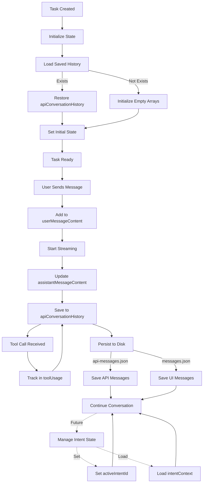
```mermaid
flowchart TD
    Start[Task Created] --> Init[Initialize State]

    Init --> LoadHistory[Load Saved History]
    LoadHistory -->|Exists| Restore[Restore apiConversationHistory]
    LoadHistory -->|Not Exists| Empty[Initialize Empty Arrays]

    Restore --> SetState[Set Initial State]
    Empty --> SetState

    SetState --> Ready[Task Ready]

    Ready --> UserInput[User Sends Message]
    UserInput --> AddUser[Add to userMessageContent]
    AddUser --> Stream[Start Streaming]

    Stream --> UpdateStream[Update assistantMessageContent]
    UpdateStream --> SaveHistory[Save to apiConversationHistory]

    SaveHistory --> ToolCall[Tool Call Received]
    ToolCall --> TrackTool[Track in toolUsage]
    TrackTool --> SaveHistory

    SaveHistory --> Persist[Persist to Disk]
    Persist -->|api-messages.json| SaveAPI[Save API Messages]
    Persist -->|messages.json| SaveUI[Save UI Messages]

    SaveAPI --> Continue[Continue Conversation]
    SaveUI --> Continue

    Continue -.->|Future| IntentState[Manage Intent State]
    IntentState -.->|Set| ActiveIntent[Set activeIntentId]
    IntentState -.->|Load| IntentContext[Load intentContext]

    ActiveIntent --> Continue
    IntentContext --> Continue
```

### Code Locations

**Primary Location**: `src/core/task/Task.ts`

**Class**: `Task extends EventEmitter<TaskEvents>`

### State Properties

#### Conversation History

```typescript
// Line 310-311
apiConversationHistory: ApiMessage[] = []  // Full API message history
clineMessages: ClineMessage[] = []         // UI message history
```

#### Streaming State

```typescript
// Lines 343-351
assistantMessageContent: AssistantMessageContent[] = []  // Current streaming response
userMessageContent: Anthropic.ContentBlockParam[] = []   // Pending user message
isStreaming: boolean = false
currentStreamingContentIndex: number = 0
```

#### Task Metadata

```typescript
// Lines 164-178
readonly taskId: string
readonly rootTaskId?: string
readonly parentTaskId?: string
readonly instanceId: string
readonly metadata: TaskMetadata
readonly workspacePath: string
```

#### Tool State

```typescript
// Lines 321-327
consecutiveMistakeCount: number = 0
toolUsage: ToolUsage = {}
didEditFile: boolean = false
```

#### API Configuration

```typescript
// Lines 285-286
apiConfiguration: ProviderSettings
api: ApiHandler
```

### State Persistence

#### API Messages

**Methods**:

- `getSavedApiConversationHistory()` (line 864) - Reads from disk
- `addToApiConversationHistory()` (line 868) - Adds and saves message
- `saveApiConversationHistory()` - Persists to disk

**Storage Location**: `{globalStoragePath}/tasks/{taskId}/api-messages.json`

#### Task Messages

**Methods** (from `src/core/task-persistence/`):

- `readTaskMessages()` - Loads task messages
- `saveTaskMessages()` - Saves task messages

**Storage Location**: `{globalStoragePath}/tasks/{taskId}/messages.json`

### State Access Patterns

#### Reading State

```typescript
// Access conversation history
task.apiConversationHistory // Direct access

// Access current streaming content
task.assistantMessageContent // Current response being built

// Access task metadata
task.taskId
task.metadata.task
```

#### Modifying State

```typescript
// Add to conversation history
await task.addToApiConversationHistory(message)

// Add tool result
task.pushToolResultToUserContent(toolResult)

// Track file edits
task.fileContextTracker.trackFileContext(path, source)
```

### Hook Integration Point

**Location**: `src/core/task/Task.ts`

**State Access**:

- Use `task.apiConversationHistory`, `task.assistantMessageContent` for context
- Access `task.workspacePath` for file operations
- Read `task.metadata` for task information

**State Modification**:

- Hook can read/write task state, but should be careful not to corrupt conversation flow
- Prefer adding new properties rather than modifying existing ones

**Intent State** (Implemented):

- `Task.activeIntentId?: string` — set by SelectActiveIntentTool on Approve; cleared by BaseTool when PreToolHook returns `clearActiveIntent`.

---

## 7. Message Flow

### Complete End-to-End Flow

This diagram shows the complete message flow from user input to tool execution and back.

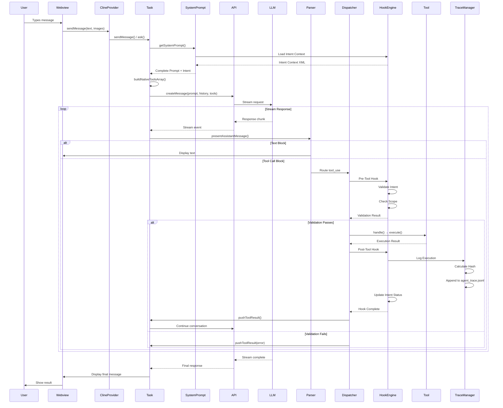
```mermaid
sequenceDiagram
    participant User
    participant Webview
    participant ClineProvider
    participant Task
    participant SystemPrompt
    participant API
    participant LLM
    participant Parser
    participant Dispatcher
    participant HookEngine
    participant Tool
    participant TraceManager

    User->>Webview: Types message
    Webview->>ClineProvider: sendMessage(text, images)
    ClineProvider->>Task: sendMessage() / ask()

    Task->>SystemPrompt: getSystemPrompt()
    SystemPrompt->>HookEngine: Load Intent Context
    HookEngine-->>SystemPrompt: Intent Context XML
    SystemPrompt-->>Task: Complete Prompt + Intent

    Task->>Task: buildNativeToolsArray()
    Task->>API: createMessage(prompt, history, tools)
    API->>LLM: Stream request

    loop Stream Response
        LLM-->>API: Response chunk
        API-->>Task: Stream event
        Task->>Parser: presentAssistantMessage()

        alt Text Block
            Parser->>Webview: Display text
        else Tool Call Block
            Parser->>Dispatcher: Route tool_use
            Dispatcher->>HookEngine: Pre-Tool Hook

            HookEngine->>HookEngine: Validate Intent
            HookEngine->>HookEngine: Check Scope
            HookEngine-->>Dispatcher: Validation Result

            alt Validation Passes
                Dispatcher->>Tool: handle() → execute()
                Tool-->>Dispatcher: Execution Result
                Dispatcher->>HookEngine: Post-Tool Hook

                HookEngine->>TraceManager: Log Execution
                TraceManager->>TraceManager: Calculate Hash
                TraceManager->>TraceManager: Append to agent_trace.jsonl
                HookEngine->>HookEngine: Update Intent Status
                HookEngine-->>Dispatcher: Hook Complete

                Dispatcher->>Task: pushToolResult()
                Task->>API: Continue conversation
            else Validation Fails
                Dispatcher->>Task: pushToolResult(error)
            end
        end
    end

    LLM-->>API: Stream complete
    API-->>Task: Final response
    Task->>Webview: Display final message
    Webview->>User: Show result
```

### Component Interaction Diagram

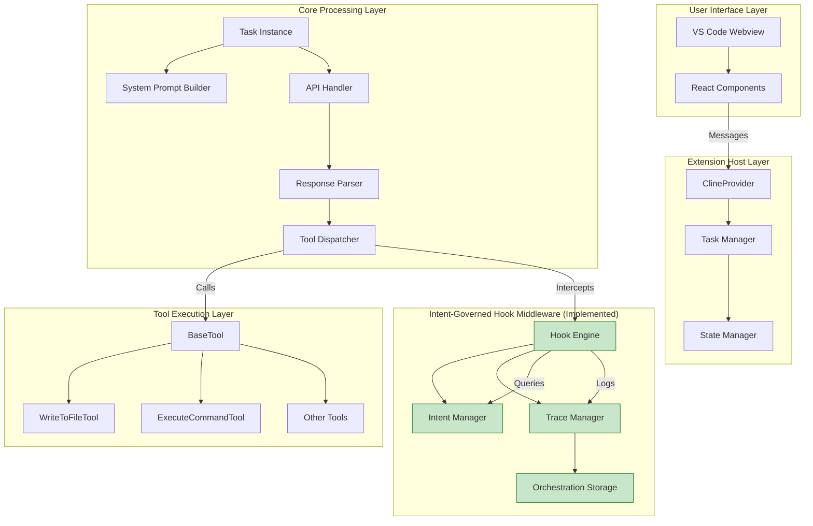
```mermaid
graph TB
    subgraph "User Interface Layer"
        A[VS Code Webview]
        B[React Components]
        A --> B
    end

    subgraph "Extension Host Layer"
        C[ClineProvider]
        D[Task Manager]
        E[State Manager]
        C --> D
        D --> E
    end

    subgraph "Core Processing Layer"
        F[Task Instance]
        G[System Prompt Builder]
        H[API Handler]
        I[Response Parser]
        J[Tool Dispatcher]
        F --> G
        F --> H
        H --> I
        I --> J
    end

    subgraph "Tool Execution Layer"
        K[BaseTool]
        L[WriteToFileTool]
        M[ExecuteCommandTool]
        N[Other Tools]
        K --> L
        K --> M
        K --> N
    end

    subgraph "Intent-Governed Hook Middleware (Implemented)"
        O[Hook Engine]
        P[Intent Manager]
        Q[Trace Manager]
        R[Orchestration Storage]
        O --> P
        O --> Q
        Q --> R
    end

    B -->|Messages| C
    J -->|Calls| K
    J -->|Intercepts| O
    O -->|Queries| P
    O -->|Logs| Q

    style O fill:#c8e6c9,stroke:#2e7d32
    style P fill:#c8e6c9,stroke:#2e7d32
    style Q fill:#c8e6c9,stroke:#2e7d32
    style R fill:#c8e6c9,stroke:#2e7d32
```

---

## 8. Hook Integration Points

### Hook System Architecture

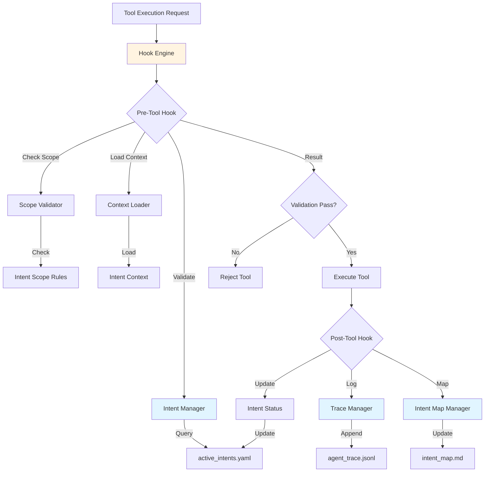
```mermaid
graph TB
    A[Tool Execution Request] --> B[Hook Engine]

    B --> C{Pre-Tool Hook}
    C -->|Validate| D[Intent Manager]
    C -->|Check Scope| E[Scope Validator]
    C -->|Load Context| F[Context Loader]

    D -->|Query| G[active_intents.yaml]
    E -->|Check| H[Intent Scope Rules]
    F -->|Load| I[Intent Context]

    C -->|Result| J{Validation Pass?}
    J -->|Yes| K[Execute Tool]
    J -->|No| L[Reject Tool]

    K --> M{Post-Tool Hook}
    M -->|Log| N[Trace Manager]
    M -->|Update| O[Intent Status]
    M -->|Map| P[Intent Map Manager]

    N -->|Append| Q[agent_trace.jsonl]
    O -->|Update| G
    P -->|Update| R[intent_map.md]

    style B fill:#fff4e1
    style D fill:#e1f5ff
    style N fill:#e1f5ff
    style P fill:#e1f5ff
```

### Hook Execution Flow

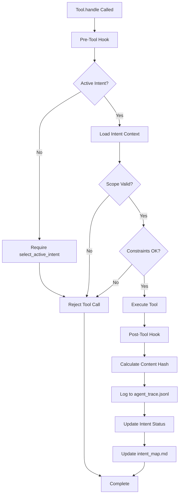
```mermaid
flowchart TD
    Start[Tool.handle Called] --> PreHook[Pre-Tool Hook]

    PreHook --> CheckIntent{Active Intent?}
    CheckIntent -->|No| RequireIntent[Require select_active_intent]
    CheckIntent -->|Yes| LoadIntent[Load Intent Context]

    RequireIntent --> Reject[Reject Tool Call]
    LoadIntent --> ValidateScope{Scope Valid?}

    ValidateScope -->|No| Reject
    ValidateScope -->|Yes| CheckConstraints{Constraints OK?}

    CheckConstraints -->|No| Reject
    CheckConstraints -->|Yes| Execute[Execute Tool]

    Execute --> PostHook[Post-Tool Hook]

    PostHook --> CalcHash[Calculate Content Hash]
    CalcHash --> LogTrace[Log to agent_trace.jsonl]
    LogTrace --> UpdateStatus[Update Intent Status]
    UpdateStatus --> UpdateMap[Update intent_map.md]

    UpdateMap --> Complete[Complete]
    Reject --> Complete
```

### Integration Summary

#### For Intent Selection Hook

1. **Add Tool Definition**: `src/core/prompts/tools/native-tools/select_active_intent.ts`
2. **Register Tool**: `src/core/task/build-tools.ts` → `buildNativeToolsArray()`
3. **Create Tool Handler**: `src/core/tools/SelectActiveIntentTool.ts`
4. **Add Dispatch Case**: `src/core/assistant-message/presentAssistantMessage.ts` → switch statement (line 678)

#### For Pre-Tool Hook

1. **Location**: `src/core/tools/BaseTool.ts` → `handle()` method (line 113)
2. **Or**: `src/core/assistant-message/presentAssistantMessage.ts` → before tool.handle() calls
3. **Purpose**: Validate intent, check scope, inject context

#### For Post-Tool Hook

1. **Location**: `src/core/tools/BaseTool.ts` → `handle()` method (after execute())
2. **Or**: `src/core/assistant-message/presentAssistantMessage.ts` → after tool.handle() calls
3. **Purpose**: Log trace, update intent status, calculate hashes

#### For System Prompt Injection

1. **Location**: `src/core/prompts/system.ts` → `generatePrompt()` function (line 41)
2. **Modification**: Add intent context loading before returning `basePrompt` (line 109)
3. **Format**: Inject `<intent_context>` XML block with active intent details

#### For Trace Logging

1. **Location**: Post-Hook after `write_to_file` completes
2. **File**: `.orchestration/agent_trace.jsonl` (workspace root)
3. **Format**: JSONL (one JSON object per line)
4. **Content**: intent_id, content_hash, file path, line ranges, mutation_class

---

## 10. TRP1 Implemented: Intent-Governed Hook Middleware (Detailed)

This section documents the **implemented** Intent-Governed Hook Middleware: every component, data flow, file format, and integration point. The system enforces intent-first tool execution, records an agent trace, supports Human-in-the-Loop (HITL) approval for intent selection, maintains an intent map and Shared Brain, and respects scope and optimistic locking.

### 10.1 Principles

- **Intent-first**: Destructive tools (`write_to_file`, `edit_file`, `execute_command`, `search_replace`, `apply_diff`, `apply_patch`) require an active intent. The user or agent must call `select_active_intent` first; the user must Approve the intent in a modal before it is set.
- **Same-workspace governance**: All intent data lives under the task’s workspace: `.orchestration/active_intents.yaml`, `.orchestration/agent_trace.jsonl`, `.orchestration/intent_map.md`, `.orchestration/AGENT.md`, `.orchestration/.intentignore`. The task’s `workspacePath` is required for validation and trace writing.
- **Pre-hook blocks, post-hook logs**: Pre-hook validates intent and scope; if it returns `allowed: false`, the tool is not executed. Post-hook runs after execution and appends to the trace (and optionally updates intent map and file-state lock); it never blocks the tool result.

### 10.2 Component Overview

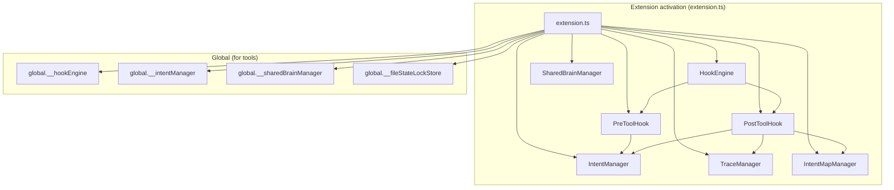
```mermaid
graph TB
    subgraph "Extension activation (extension.ts)"
        EXT[extension.ts] --> HE[HookEngine]
        EXT --> IM[IntentManager]
        EXT --> TM[TraceManager]
        EXT --> IMM[IntentMapManager]
        EXT --> SBM[SharedBrainManager]
        EXT --> PH[PreToolHook]
        EXT --> POH[PostToolHook]
        HE --> PH
        HE --> POH
        POH --> TM
        POH --> IMM
        PH --> IM
        POH --> IM
    end
    subgraph "Global (for tools)"
        GHE["global.__hookEngine"]
        GIM["global.__intentManager"]
        GSB["global.__sharedBrainManager"]
        GFS["global.__fileStateLockStore"]
    end
    EXT --> GHE
    EXT --> GIM
    EXT --> GSB
    EXT --> GFS
```

- **HookEngine**: Single pre-hook and single post-hook registered at activation. BaseTool calls `executePreHooks(context)` before `execute()` and `executePostHooks(context, executionResult)` in a `finally` block after `execute()`.
- **PreToolHook**: Validates workspace, loads intents from `active_intents.yaml`, resolves active intent (from `context.activeIntentId` or `IntentManager.getActiveIntent(taskId, workspacePath)`), blocks if no intent or scope violation or stale file; records blocked lessons to Shared Brain; loads `.intentignore` and skips scope check for matching paths; records CREATE/MODIFY for the path so PostToolHook can classify INTENT_EVOLUTION vs AST_REFACTOR.
- **PostToolHook**: For `execute_command`, on failure appends a lesson to Shared Brain. For `write_to_file` and `edit_file`: only when execution succeeded and active intent and workspace and path/content are present, creates a trace entry via TraceManager, appends to `agent_trace.jsonl`, on CREATE appends to `intent_map.md` via IntentMapManager, and updates the file-state lock store.
- **IntentManager**: Reads/writes `active_intents.yaml` (no cache; always from disk). In-memory map `taskId -> intentId` for active intent. `setActiveIntent`/`getActiveIntent`/`clearActiveIntent`; `getIntent(id, workspace)` validates intent still exists in YAML. `formatIntentContext(intent)` produces XML for system prompt injection.
- **TraceManager**: `createTraceEntry(...)` builds internal `TraceLogEntry` (intentId, contentHash, filePath, mutationClass, timestamp, toolName, optional lineRanges, gitSha). `toSpecEntry(entry)` converts to `SpecTraceLogEntry` with `id` (UUID), `related: [{ type: "specification", value: intentId }]`, and optional `vcs: { revision_id: gitSha }`. `appendTraceEntry(entry, workspaceRoot)` appends one JSON line to `agent_trace.jsonl` via OrchestrationStorage.
- **IntentMapManager**: On INTENT_EVOLUTION (trace classification for CREATE), appends a table row to `intent_map.md` (Intent ID | File Path | Timestamp).
- **SharedBrainManager**: `getContent(workspaceRoot)` reads `.orchestration/AGENT.md` for system prompt injection. `append(workspaceRoot, content)` creates the file with a header if missing, then appends. PreToolHook and PostToolHook append lessons when blocking or when `execute_command` fails; `record_shared_brain` tool also appends.
- **OrchestrationStorage**: All paths under `workspaceRoot/.orchestration/` when `workspaceRoot` is provided. `readFile`, `writeFile`, `appendFile`, `fileExists`; ensures directory exists before write/append.
- **ScopeValidator**: Glob matching (minimatch) of file path against intent `ownedScope` patterns. Used by PreToolHook; paths matching `.intentignore` patterns skip scope check.
- **FileStateLockStore**: In-memory expected content hash per file path for optimistic locking. PreToolHook checks staleness before allowing write; PostToolHook updates the store after a successful write.

### 10.3 End-to-End Flow (Write Path)

1. **Intent selection**: Agent (or user) invokes `select_active_intent` with `intent_id`. SelectActiveIntentTool loads intent from `active_intents.yaml`, then shows `vscode.window.showWarningMessage(..., "Approve", "Reject")`. Only on "Approve" does it call `IntentManager.setActiveIntent(taskId, intent_id)` and set `task.activeIntentId = intent_id`.
2. **Tool call**: Agent calls `write_to_file` or `edit_file`. presentAssistantMessage routes to the tool’s `handle(task, block, callbacks)`.
3. **BaseTool.handle**: Parses params from `nativeArgs`, builds `ToolExecutionContext` (toolName, toolParams, taskId, workspacePath, activeIntentId). Calls `hookEngine.executePreHooks(context)`.
4. **PreToolHook**: Requires `workspacePath`. Loads intents; if none, blocks. Resolves active intent (context or getActiveIntent); if none, blocks and optionally sets `clearActiveIntent`. For file tools, validates path against intent scope (or .intentignore), checks file-state lock for staleness, records CREATE/MODIFY for path in `__lastWriteMutationByPath`. Returns `{ allowed: true }` or `{ allowed: false, error, clearActiveIntent? }`.
5. **BaseTool**: If pre-hook blocked, calls `handleError` and returns; if `clearActiveIntent`, sets `task.activeIntentId = undefined`. Otherwise calls `await this.execute(params, task, callbacks)`, then in `finally` calls `hookEngine.executePostHooks(context, executionResult)`.
6. **PostToolHook**: For `write_to_file`/`edit_file`, only if `result.success !== false` and active intent and workspace and path/content present: creates trace entry (mutationClass from PreToolHook or determined by file existence), appends to `agent_trace.jsonl`, on CREATE appends to `intent_map.md`, updates file-state lock. For `execute_command` failure, appends lesson to Shared Brain.
7. **Trace file**: Each line in `agent_trace.jsonl` is a JSON object: `id`, `timestamp`, `intent_id`, `operation: "WRITE"`, `file_path`, `content_hash` (sha256:...), `classification` (INTENT_EVOLUTION or AST_REFACTOR), `related: [{ type: "specification", value: intentId }]`, optional `vcs: { revision_id }`.

### 10.4 .orchestration/ File Formats

| File                  | Purpose                                                                                         | Format                                              |
| --------------------- | ----------------------------------------------------------------------------------------------- | --------------------------------------------------- |
| `active_intents.yaml` | Intent definitions (id, name, description, status, ownedScope, constraints, acceptanceCriteria) | YAML, `intents: []`                                 |
| `agent_trace.jsonl`   | Append-only trace of file writes                                                                | One JSON object per line (SpecTraceLogEntry)        |
| `intent_map.md`       | Intent → file mapping for INTENT_EVOLUTION                                                      | Markdown table: Intent ID \| File Path \| Timestamp |
| `AGENT.md`            | Shared Brain: lessons and decisions                                                             | Markdown; header + append-only lines                |
| `.intentignore`       | Glob patterns; matching paths skip scope check                                                  | One pattern per line, # comments                    |

**agent_trace.jsonl schema (SpecTraceLogEntry)**:

- `id`: UUID (one per entry).
- `timestamp`: ISO 8601.
- `intent_id`: Governing intent ID.
- `operation`: `"WRITE"`.
- `file_path`: Relative to workspace root.
- `content_hash`: `sha256:<hex>`.
- `classification`: `"INTENT_EVOLUTION"` (file create) or `"AST_REFACTOR"` (file modify).
- `related`: `[{ "type": "specification", "value": "<intent_id>" }]`.
- `vcs` (optional): `{ "revision_id": "<git-sha>" }`.

### 10.5 System Prompt Injection

In `Task.getSystemPrompt()` (Task.ts): after building `basePrompt`, the code obtains `__intentManager` and, if there is an active intent for this task (getActiveIntent), appends `intentManager.formatIntentContext(intent)` (XML block with intent_id, name, description, owned_scope, constraints, acceptance_criteria). It then obtains `__sharedBrainManager` and, if `getContent(workspacePath)` returns non-empty content, appends that to the prompt. Thus every request gets the active intent context and Shared Brain when available.

### 10.6 Tool Integration

- **select_active_intent**: Tool definition in `src/core/prompts/tools/native-tools/select_active_intent.ts`; handler `SelectActiveIntentTool` in `src/core/tools/SelectActiveIntentTool.ts`. HITL: `showWarningMessage(..., "Approve", "Reject")`; only Approve sets intent and `task.activeIntentId`.
- **get_active_intent**: Read-only tool to query current active intent.
- **write_to_file**: Optional `intent_id` and `mutation_class` in schema for traceability; when omitted, system uses active intent and file existence. Pre-hook enforces intent and scope; post-hook records trace.
- **record_shared_brain**: Tool that appends a message to `.orchestration/AGENT.md` via SharedBrainManager.

### 10.7 Extension Registration (extension.ts)

- `OrchestrationStorage`, `IntentManager`, `TraceManager`, `IntentMapManager`, `SharedBrainManager` created once.
- `HookEngine` created; `PreToolHook` and `PostToolHook` instantiated with the above; `registerPreHook(preToolHook.run)`, `registerPostHook(postToolHook.run)`.
- `initializeSelectActiveIntentTool(intentManager)`, `initializeGetActiveIntentTool(intentManager)`.
- `(global as any).__hookEngine = hookEngine`, `__intentManager = intentManager`, `__sharedBrainManager = sharedBrainManager`, `__fileStateLockStore = new FileStateLockStore()`.

### 10.8 Diagnostic Logging (PostToolHook)

When trace is skipped, PostToolHook logs a warning: execution not succeeded, no active intent, no workspace root, missing path/content, or could not read file after edit_file. When a trace entry is appended, it logs an info line with file path and intent id. TraceManager rethrows on append failure so PostToolHook can log "[PostToolHook] Failed to log trace entry".

---

## 9. Implementation Roadmap

### Phase 1: Foundation — **Done**

1. **Create Hook Infrastructure** (`src/hooks/` directory) — **Done**

    - `HookEngine.ts` - Main middleware coordinator
    - `PreToolHook.ts` - Pre-execution validation (intent, scope, stale file)
    - `PostToolHook.ts` - Trace logging, intent_map, Shared Brain lessons

2. **Implement IntentManager** (`src/hooks/IntentManager.ts`) — **Done**

    - Read/write `active_intents.yaml` (no cache; always from disk)
    - setActiveIntent / getActiveIntent / clearActiveIntent
    - formatIntentContext() for system prompt

3. **Create OrchestrationStorage** (`src/hooks/OrchestrationStorage.ts`) — **Done**
    - File I/O for `.orchestration/` with optional workspaceRoot
    - ensureOrchestrationDirectory; readFile, writeFile, appendFile, fileExists

### Phase 2: Intent Selection — **Done**

4. **Create select_active_intent Tool** — **Done**
    - Tool definition: `src/core/prompts/tools/native-tools/select_active_intent.ts`
    - Tool handler: `src/core/tools/SelectActiveIntentTool.ts` with **HITL**: `showWarningMessage(..., "Approve", "Reject")`; only Approve sets intent
    - Register in build-tools; dispatch in `presentAssistantMessage.ts`

### Phase 3: System Prompt Integration — **Done**

5. **Intent + Shared Brain injection** — **Done**
    - In `Task.getSystemPrompt()`: inject active intent XML via IntentManager.formatIntentContext()
    - Inject Shared Brain content via SharedBrainManager.getContent(workspacePath)

### Phase 4: Tool Hooks — **Done**

6. **Wrap BaseTool.handle()** (`src/core/tools/BaseTool.ts`) — **Done**

    - Pre-hook before execute(); on allowed: false, handleError and return; on clearActiveIntent, clear task.activeIntentId
    - Post-hook in finally block with executionResult (success/failure)

7. **Scope + locking** — **Done**
    - ScopeValidator (glob) for file paths; `.orchestration/.intentignore` patterns skip scope
    - FileStateLockStore for optimistic locking (stale file check in PreToolHook, update in PostToolHook)

### Phase 5: Trace Logging — **Done**

8. **TraceManager** (`src/hooks/TraceManager.ts`) — **Done**

    - createTraceEntry (contentHash, mutationClass, etc.); toSpecEntry (id, related, vcs)
    - appendTraceEntry → agent_trace.jsonl (workspace-scoped)

9. **IntentMapManager** (`src/hooks/IntentMapManager.ts`) — **Done**
    - appendIntentEvolutionEntry on INTENT_EVOLUTION (CREATE) from PostToolHook

### Phase 6: Advanced Features — **Done**

10. **Optimistic locking** — **Done** (FileStateLockStore + PreToolHook/PostToolHook)

11. **Shared Brain** — **Done**
    - SharedBrainManager: AGENT.md getContent/append; PreToolHook/PostToolHook record lessons; record_shared_brain tool; Task injects into system prompt

---

## 11. Critical Code References

### System Prompt

- **Main**: `src/core/prompts/system.ts:112` (`SYSTEM_PROMPT`)
- **Called From**: `src/core/task/Task.ts:3792` (`getSystemPrompt()`)
- **Sections**: `src/core/prompts/sections/*.ts`

### Response Parsing

- **Main**: `src/core/assistant-message/presentAssistantMessage.ts:61`
- **Parser**: `src/core/assistant-message/NativeToolCallParser.ts:99`

### Tool Dispatch

- **Main**: `src/core/assistant-message/presentAssistantMessage.ts:678` (switch statement)
- **Base**: `src/core/tools/BaseTool.ts:113` (`handle()` method)

### write_to_file

- **Implementation**: `src/core/tools/WriteToFileTool.ts:29` (`execute()`)
- **Dispatched**: `src/core/assistant-message/presentAssistantMessage.ts:679`

### execute_command

- **Implementation**: `src/core/tools/ExecuteCommandTool.ts:34` (`execute()`)
- **Dispatched**: `src/core/assistant-message/presentAssistantMessage.ts:764`

### Task State

- **Class**: `src/core/task/Task.ts:163`
- **History**: `src/core/task/Task.ts:310` (`apiConversationHistory`, `clineMessages`)
- **Persistence**: `src/core/task-persistence/*.ts`
- **Intent + Shared Brain injection**: `Task.getSystemPrompt()` (Task.ts) uses `__intentManager.formatIntentContext()`, `__sharedBrainManager.getContent(workspacePath)`

### Hook Middleware (Intent-Governed)

- **Registration**: `src/extension.ts` — HookEngine, PreToolHook, PostToolHook, globals `__hookEngine`, `__intentManager`, `__sharedBrainManager`, `__fileStateLockStore`
- **Interception**: `src/core/tools/BaseTool.ts:162` — pre-hook before execute, post-hook in finally with executionResult; handles `preResult.clearActiveIntent`
- **Pre-hook**: `src/hooks/PreToolHook.ts:94` (`run`) — DESTRUCTIVE_TOOLS, workspacePath required, intent resolve, scope + .intentignore, stale-file check, \_\_lastWriteMutationByPath
- **Post-hook**: `src/hooks/PostToolHook.ts:57` (`run`) — MUTATION_TOOLS (write_to_file, edit_file), trace append, intent_map on CREATE, file-state lock update; execute_command failure → Shared Brain lesson
- **Intent selection (HITL)**: `src/core/tools/SelectActiveIntentTool.ts:48` — showWarningMessage Approve/Reject; setActiveIntent + task.activeIntentId only on Approve
- **Trace**: `src/hooks/TraceManager.ts` — createTraceEntry, toSpecEntry (id, related, vcs), appendTraceEntry → agent_trace.jsonl
- **Types**: `src/hooks/types.ts` — ToolExecutionContext, PreHookResult, PostHookResult, SpecTraceLogEntry, TraceClassification

---

## 12. File Structure for Hook System

### Source Code Structure (Implemented)

```
src/hooks/
├── HookEngine.ts              # Main middleware coordinator; executePreHooks / executePostHooks
├── PreToolHook.ts             # Intent + scope + stale-file validation; .intentignore; records CREATE/MODIFY for PostToolHook
├── PostToolHook.ts            # Trace append, intent_map on INTENT_EVOLUTION, Shared Brain lessons, file-state lock update
├── IntentManager.ts           # active_intents.yaml (no cache); setActiveIntent / getActiveIntent / clearActiveIntent; formatIntentContext
├── TraceManager.ts            # createTraceEntry, toSpecEntry (id, related, vcs), appendTraceEntry → agent_trace.jsonl
├── IntentMapManager.ts        # appendIntentEvolutionEntry → intent_map.md
├── SharedBrainManager.ts      # AGENT.md getContent / append (Shared Brain)
├── OrchestrationStorage.ts    # .orchestration/ readFile, writeFile, appendFile, fileExists (workspace-scoped)
├── ScopeValidator.ts          # Glob matching (minimatch) for intent ownedScope
├── types.ts                   # ToolExecutionContext, PreHookResult, PostHookResult, SpecTraceLogEntry, etc.
└── FileStateLockStore.ts      # In-memory expected hash per path (optimistic locking; used by Pre/PostToolHook)

tests/hooks/
├── HookEngine.test.ts
├── IntentManager.test.ts
├── TraceManager.test.ts
├── ScopeValidator.test.ts
├── PreToolHook.test.ts
├── PostToolHook.test.ts
└── OptimisticLockManager.test.ts

tests/integration/
├── intent-selection-flow.test.ts
├── scope-validation-flow.test.ts
├── trace-logging-flow.test.ts
├── content-hashing-flow.test.ts
├── optimistic-locking-flow.test.ts
└── intent-context-injection.test.ts
```

### Workspace Orchestration Directory

```
.orchestration/                # Workspace root directory (created automatically)
├── active_intents.yaml        # Intent specifications (YAML format)
├── agent_trace.jsonl          # Append-only action log (JSONL format)
├── intent_map.md              # Spatial map of intents (Markdown format)
└── AGENT.md                   # Shared brain (lessons learned, future enhancement)
```

**Directory Creation**: The `.orchestration/` directory is created automatically by `OrchestrationStorage` when first accessed. It is located at the workspace root (same level as `.git`, `src/`, etc.).

**File Formats**:

- `active_intents.yaml`: YAML format for human-readable intent definitions
- `agent_trace.jsonl`: JSONL format (one JSON object per line) for append-only logging
- `intent_map.md`: Markdown format for human-readable spatial mapping
- `AGENT.md` (**Shared Brain**): Markdown file maintained by `SharedBrainManager`. Created with a header on first append; all subsequent writes are append-only. Used for lessons learned (e.g. when verification fails) and architectural decisions. Shared across parallel sessions (Architect/Builder/Tester).

---

**End of Architecture Notes**
